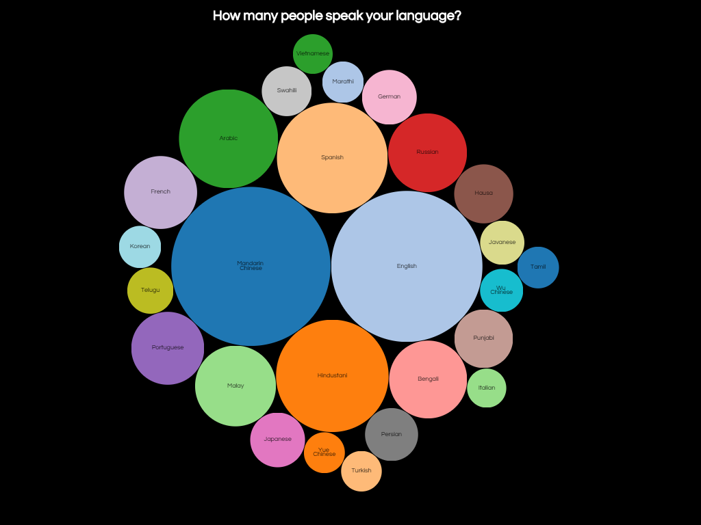

# Speaking a language?

In this assesment I made a bubble chart with given data. The data I used was the amount of speakers per language. This chart is based [`bl.ock`](https://bl.ocks.org/mbostock/4063269) by
[**@mbostock**](https://github.com/mbostock) (GPL-3.0).

> My work
> [**Velomovies**](https://velomovies.github.io/fe3-assessment-1/).

## Background

This asssesment contains a bubble chart. It is based on [`bl.ock`](https://bl.ocks.org/mbostock/4063269). I have changed a few thing in the js to make it my own. First I tried to understand the code. After I did understand it I changed the code a bit to my likings. 

Firstly I added another color scheme which makes the bublles all different. The color schemes could easily be changed with existing themes. 

Secondly I removed unnecessary code. Like making a link in each circle I didn't use, so I removed it.

At last I wanted a more dynamic website. I created a `hover state` on every `.node` so the circle color changes when you hover over. I also added a little transition which starts when opening the page. As you can see the bubbles appear after eachother. I created this by having a transition delay on each `.node`. In js I have a `.style` which adds a transition delay of a few seconds. This delay is calculated by dividing the radius by 100. This creates a certain amount of seconds.

When you hover over every bubble you can see the exact number of people per language. 

## Data

d3 is using a tsv (tab-separated value) file to make a visualization. 
* `language` — language are the different languages in the dataset.
* `speakers` — Speakers are the amount of people speaking a certain language

## Features
*   [`d3-format`](https://github.com/d3/d3-format#api-reference)
    — `d3.format([number])`
*   [`d3-hierarchy`](https://github.com/d3/d3-hierarchy#api-reference)
    — `d3.hierarchy(data[, children])`
    — `d3.pack`
*   [`d3-request`](https://github.com/d3/d3-request#api-reference)
    — `d3.tsv`
    — Loading files

## License

GPL-3.0 © Victor Zumpolle
